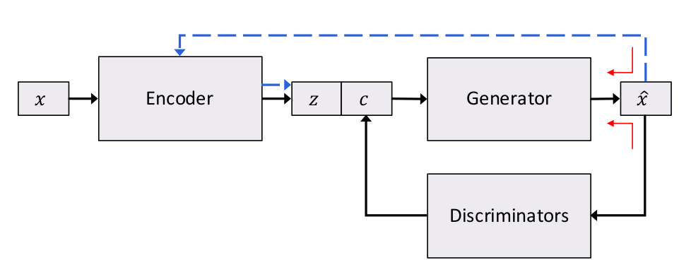
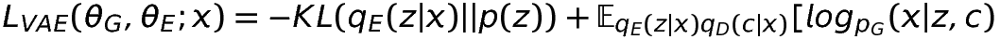
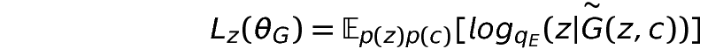
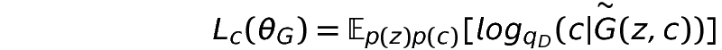
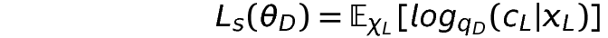
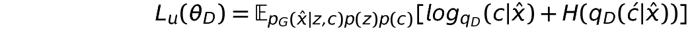

# Controllable Generation of Sentences

- This is a pytorch implementation of the Encoder-Generator-Discriminator architecture for learning disentagled representations of text

### Architecture Diagram
<p align="center"></p>

### How does the archicture work?

- We have three modules, an <b> Encoder </b>, a <b> Generator </b> and a <b> Discriminator. </b>. Training is done in a wake-sleep fashion.
- Encoder takes `x` as input and produces a latent vector `z` . We define a structured controllable vector `c`. Generator takes the concatenated vector `z,c` to generate the corresponding sentence `x'`. Discriminator ensures that the generated sentence is consistent with the contrallable vector `c`.   
- Modules are learned in a way such that we get disentangled representations. When all modules are trained we expect:
  - A generator to produce novel sentences conditioned on `c`
  - An encoder to capture all features other than `c` in a vector `z`.
  - A discriminator that can be used to identify `c` given a sentence. 
- In this implementation, c only represents a sentiment, i.e postive or negative (dim(c) = 1).
- Discriminator is a TEXT_CNN. In principle, we can use more than one discriminator for other features like tense, humor, etc if we have some labeled examples. 

## Loss Functions

### Encoder Loss

<p align="left">

- VAE Loss: Variational-Autoencoder Loss which has KL-Divergence and Cross-Entropy. KLD annealing is used to avoid the loss from KLD to drop zero once the training begins.
  
    

</p>

### Generator Loss

- VAE Loss

<p align="left">

- Reconstruction of z: The generated sentence is sent back to encoder and loss from reconstruction of z is added to the generator loss. To pass the gradient back to generator, soft distribution is used as the input. 
</p>

<p align="left">

- Reconstruction of c: The generated sentence is used as input to discriminator. Again we use soft distribution as the input. 
</p>

### Discriminator Loss (semi-supervised learning with signal from generated data)

<p align="left">

- Loss from labelled data: Here X<sub>L</sub> are the sentences and C<sub>L</sub> are the corresponding labels.

</p>

<p align="left">

- Loss from generated data: In the sleep phase, sentences are generated for random `z` and `c`. Discriminator uses that `c` as the signal for the generated data. An additional entropy regularizing term is used to alleviate the issue of noisy data from generator.

</p>

## Data

Link - (https://drive.google.com/open?id=1EUywrhUgtc2IjiU12ZmN8xTGDWqdIXRR)

## Reference

```
Toward Controlled Generation of Text
Zhiting Hu, Zichao Yang, Xiaodan Liang, Ruslan Salakhutdinov, Eric P. Xing ;
Proceedings of the 34th International Conference on Machine Learning, PMLR 70:1587-1596, 2017.
```

